# Getting started with SAP WebIDE

1. [Create an Account](https://www.sap.com/developer/topics/sap-webide.html)
2. Activate the account
3. Go to services
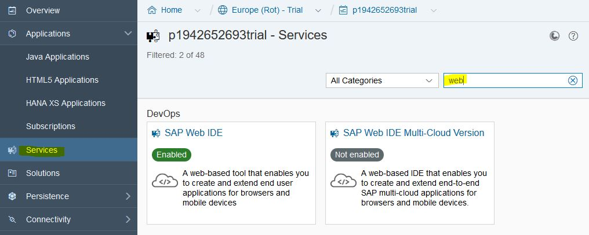

4. Search for "web ide"
5. Select the Tile and press "Go to Service"
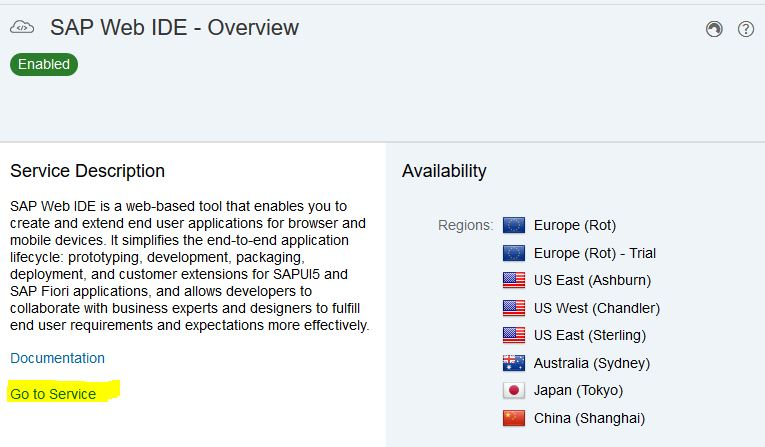

* Do the setup in the WebIDE either [with](#using-a-github-account) or [without](#without-a-github-account) github account

## Using a github account

### Initial import

1. It makes sense to fork your repository. Then you can save your process on the Github servers.
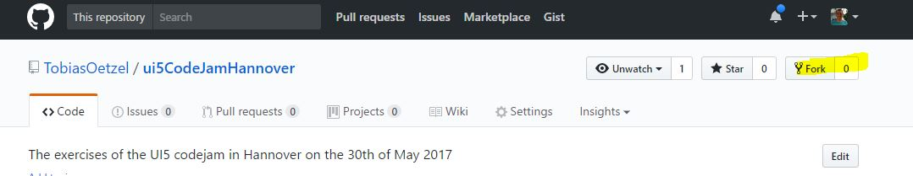

2. Press on "Clone from Git repository"
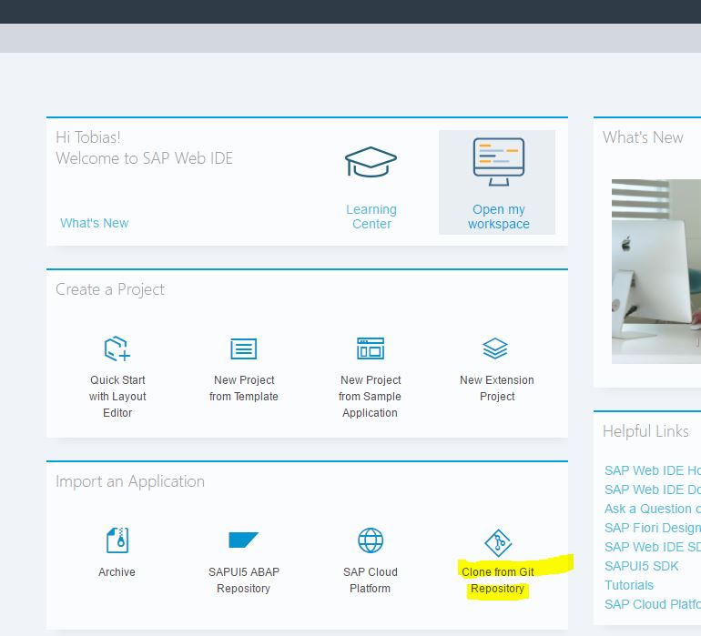

3. Press the Clone or download button on your fork
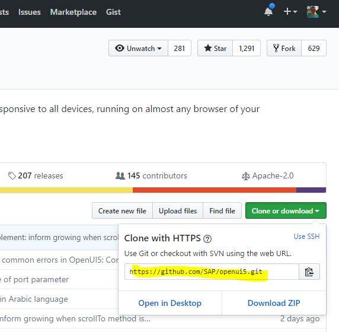

4. Copy the displayed Url and paste in in the dialog in the WebIDE
5. You can now [run your application](#running-the-application). Initially you are on step 35 - you can checkout step0 to start from scratch

### github: Checking out a step

1. Save all your changes by committing or stashing them. Later you can continue by checking out this branch again.

    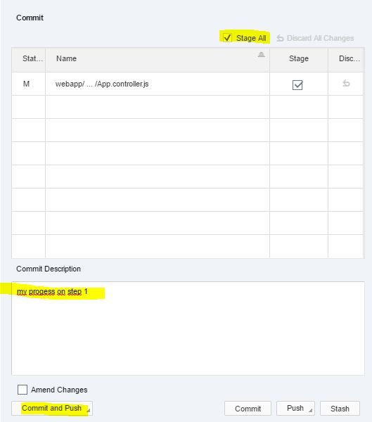</src>

2. Switch to the history tab and double click on the checkbox of the entry you want to checkout.
Afterwards you are on a new branch and continue on this step.

    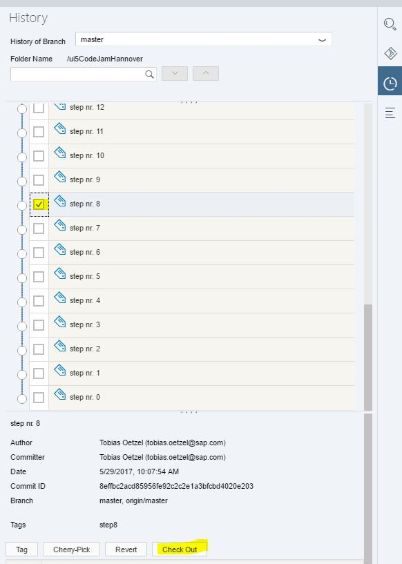</src>

## Without a github account

Checking out a step and the initial import are the same.

1. Choose the step you want to work on in github 

    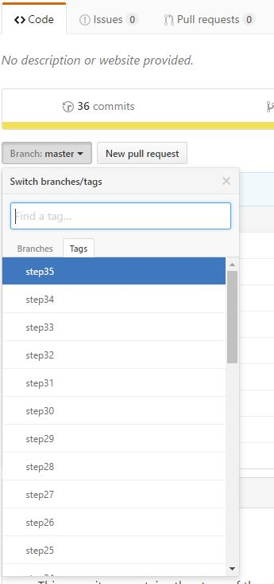</src>

2. Download the content as a Zip file 

    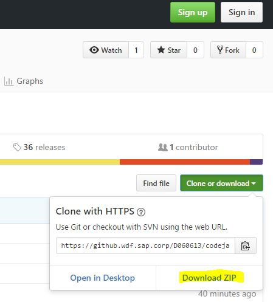</src>

3. Open the import dialog of the WebIDE 

    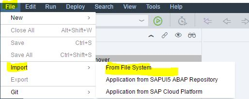</src>

4. Choose the downloaded Zip. In the Import to field, make sure it contains only one level eg: "/step0"
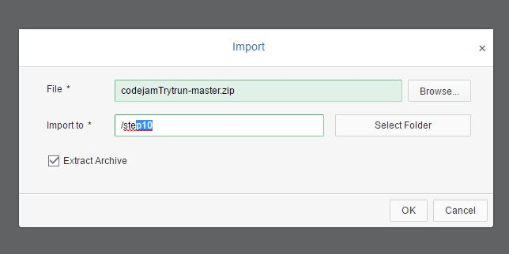

6. In the newly created folder the structure is a bit mixed up you will have an additional folder - make sure to cut everything in the folder.
7. Select all files and folders in the inner directory (docs, webapp, ...) and cut them (ctrl + x). Then select the folder you typed in the dialog ("step0")
and paste (ctrl + v) them.

    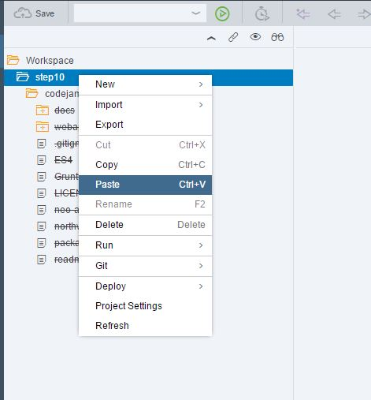</src>

8. You can now [run your application](#running-the-application)

## Odata - Importing the destinations

Destinations are used to connect to different systems on the SAP Cloud Platform
In our walkthrough we connect to the northwind service.

1. Go to the "Destinations" in the "Connectivity" section
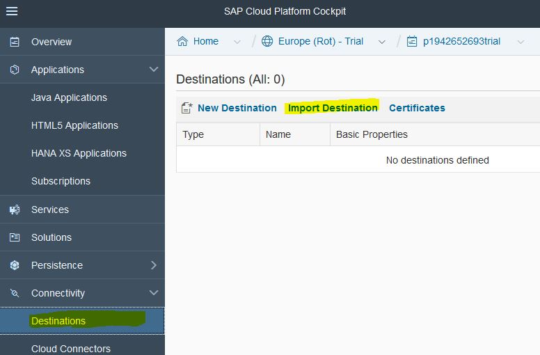

2. Select [northwind](../northwind) or [es4](../ES4) and save them on your harddrive
3. Press the import button
4. Edit the ES4 destination and type your user and password to avoid authentication popups.

## Running the application

The Walkthrough contains 4 runnable files (.html files) (Initially only one).
To run it you can select the index.html file and select "Run as Web Application".

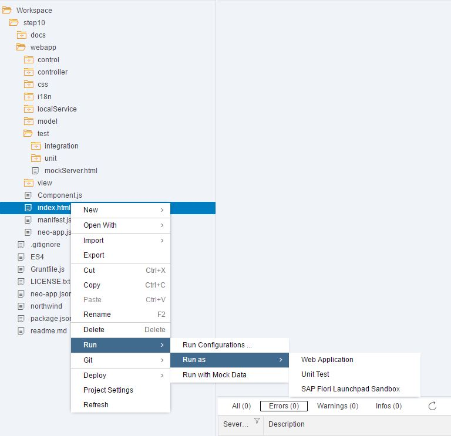